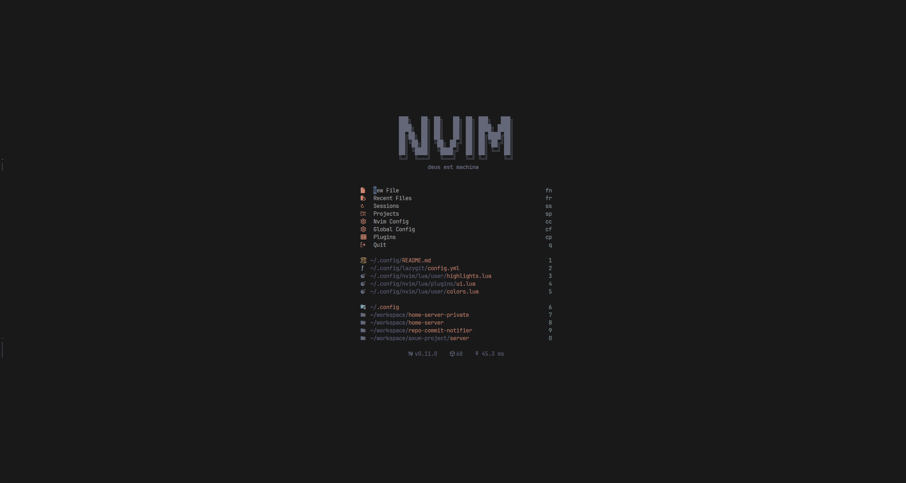
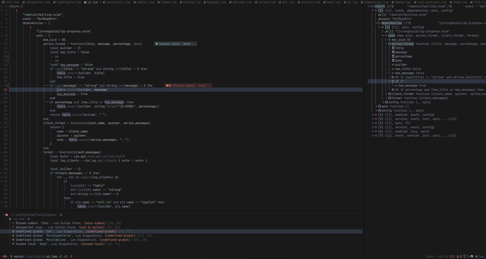
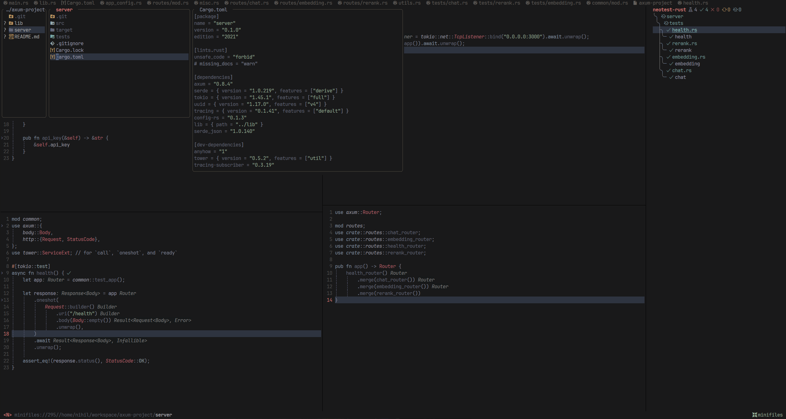

# Neovim Configuration

> Visit my [dotfiles](https://github.com/egemenkopuz/dotfiles) repository, to see my whole dotfiles

You can find the list of plugins in [PLUGINS.md](PLUGINS.md)







## Install Instructions

Clone the repository:

```sh
git clone https://github.com/egemenkopuz/nvim.git ~/.config/egemenkopuz/nvim
```

Open Neovim with this config:

```sh
NVIM_APPNAME=egemenkopuz/nvim/ nvim
```
